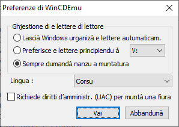
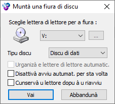

# Installazione

## Istruzzioni per installà l’interfaccia di _WinCDEmu_ in lingua corsa

### Scaricamentu

Scaricà u schedariu chì cuntene a lingua corsa di l’interfaccia
- Andà à st’indirizzu :  
https://github.com/Patriccollu/Lingua_Corsa-Infurmatica/blob/master/Prughjetti/WinCDEmu/vmnt_corsican.lng
- Fà un cliccu dirittu nant’à u buttone « _Raw_ » chì si trova insù è à dirittu, accant’à l’icone di u screnu, di a mina è di a curbella
- Sceglie l’ozzione « _Arregistrà a sibula di a leia sottu…_ »

### Installazione

Cupià stu schedariu in u cartulare d’installazione di _WinCDEmu_, secondu à u vostru prucessore :
- Urdinatore 64 bit : `C:\Program Files (x86)\WinCDEmu\langfiles`
- Urdinatore 32 bit : `C:\Program Files\WinCDEmu\langfiles`

### Persunalizazione

Quandu u schedariu di lingua si trova in u sottucartulare `\langfiles\`
- Lancià u prugramma __WinCDEmu Settings__ per fighjà o mudificà e preferenze di u prugramma

- Cambià a lingua di l'interfaccia per sceglie : `Corsu`

Fate casu chì sta lingua si trova guasi à a fine di a lista di e lingue pruposte.

### Verificazione

- Si pò verificà chì a langua di st’interfaccia hè u corsu
- Lancià l’espluratore Windows è fà un cliccu dirittu nant’à un schedariu cù l’estensione `.iso`  
Ci hè l’ozzione addiziunale : `Selezziunà a lettera di lettore è muntà`

