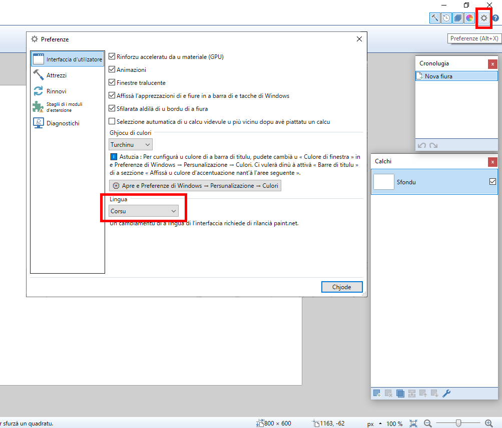

# Installazione

## Istruzzioni per installà l’interfaccia di _paint.net_ in lingua corsa

### Scaricamentu

Scaricà u schedariu chì cuntene a lingua corsa di l’interfaccia
- Andà à st’indirizzu :  
https://github.com/Patriccollu/Lingua_Corsa-Infurmatica/blob/ceppu/Prughjetti/paint.net/PaintDotNet.Strings.3.co.resources
- Fà un cliccu dirittu nant’à u buttone « _Download_ » chì si trova insù è à dirittu, accant’à l’icona di u screnu è quella di a curbella.
- Sceglie l’ozzione « _Arregistrà a sibula di a leia sottu…_ »

### Installazione

- Cupià stu schedariu in u cartulare d’installazione di _paint.net_ :  
`C:\Program Files\paint.net\`
- D’altronde, in quellu cartulare, si trovanu parechji schedarii di lingua cù stu mudellu di nome :  
`PaintDotNet.Strings.3.xx.resources`

### Persunalizazione

- Lancià _paint.net_
- Affissà e preferenze di u prugramma cù l’icona in forma di rotula, insù è à diritta
- In l’unghjettu `Interfaccia di l’utilizatore`, à a rubrica `Lingua`, sceglie a lingua `Corsu`

### Verificazione

Ci vole à rilancià _paint.net_ è tandu a so interfaccia hè in lingua corsa.  

#### Liami di navigazione nant’à stu situ
- [Rivene à a lista di i membri di stu prughjettu](./)
- [Rivene à a lista di tutti i prughjetti](../)
- [Rivene à a lista di tutti i prugrammi](../../../../#readme)
