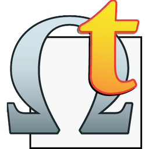
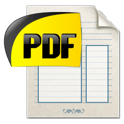
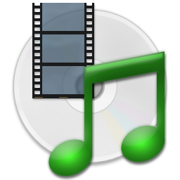

# È a lingua corsa in l’infurmatica ?

Parechji prugrammi infurmatichi sò stati tradutti in corsu. Di bona regula, ùn ci hè nunda à fà di particulare per impiegalli in lingua corsa, fora di installalli è dopu di sceglie a lingua « corsu » o « corsican ». Per certi, per indettu quelli ch’impieganu i prugrammi d’installazione Inno Setup o NSIS, ghjè ancu pussibule d’installalli in lingua corsa !
  
A maiò parte di sti prugrammi hè di tipu « Fonte Aperta », o 'Open Source' in inglese, o GNU, vole si dì chì _ùn ci hè nunda à pagà per impiegalli._ Certi ponu esse venduti da una sucetà ma, in stu casu, ghjè una versione, forse senza tutte e so funzioni, chì si pò impiegà di rigalu.
  
Eccu una lista, ordinata in trè parti : i prugrammi tradutti in lingua corsa ch’ellu si pò impiegà subitu, quelli in attesa di distribuzione è l’ultimi in corsu di traduzzione. In ogni parte di sta lista, classificatu da u so nome, ci hè l’icona di u prugramma, u so situ web ufficiale, è una corta discrizzione per sapè ciò ch’ellu face. Nant’à certe icone, si pò fà un cliccu per sapene di più annnant’à a traduzzione in lingua corsa di u prugramma.

-----
# 1) I prugrammi _tradutti_ in lingua corsa :

## ✨ 7-zip <a href="#"></img></a>
https://www.7-zip.org/  
_Per cumpresse o stringhje unu o parechji schedarii, o cartulari, in un solu schedariu più chjucu. In più di què, stu schedariu cumpressu pò esse prutettu da una parolla d’intesa. A cumpressione è a scumpressione hè permessa per i furmati : 7z, XZ, BZIP2, GZIP, TAR, ZIP è WIM. Ma a scumpressione sola hè pussibule per tutti quelli : AR, ARJ, CAB, CHM, CPIO, CramFS, DMG, EXT, FAT, GPT, HFS, IHEX, ISO, LZH, LZMA, MBR, MSI, NSIS, NTFS, QCOW2, RAR, RPM, SquashFS, UDF, UEFI, VDI, VHD, VMDK, WIM, XAR è Z._

## ✨ Audacity <a href="./Prughjetti/Audacity/Traduzzione.md"></img></a>
https://www.audacityteam.org/  
_Per arregistrà un sonu, un testu parlatu o una musica cù u microfonu di l’urdinatore è per trasfurmalli in schedarii MP3 o WAV. Si pò dinù mudificà i schedarii audio cù filtri numarosi, fà un mischiu cù parechji soni, è d’altre funzioni guasi prufessiunale. Stu prugramma funziuneghja nant’à Windows, Mac è Linux._

## ✨ CCleaner <a href="./Prughjetti/CCleaner/Traduzzione.md"></img></a>
https://www.ccleaner.com/ccleaner  
_Per nettà ciò chì ùn serve à nunda nant’à u vostru urdinatore è ottene un PC più nettu, più sicuru è più rapidu. Stu prugramma pò dinù analizà a versione di i prugrammi è di i piloti installati._  
  
> ⚠️ __Fate casu__ : selezziunate a versione di a vostra scelta : _CCleaner Free_ chì hè di rigalu, o _CCleaner Professional_ ch’ellu ci vole à pagà.

## ✨ CDex <a href="#"></img></a>
https://cdex.mu/  
_Per estrae i dati d’un CD Audio, ghjè ciò chì si chjama un CD Ripper o un utilitariu CDDA. Si pò creà un schedariu audio urdinariu (WAV) o cumpressu grazia à un cudificatore cum’è MP3, FLAC, AAC, WMA, OGG, è tanti altri. Di più, i schedarii WAV chì si trovanu nant’à l’urdinatore ponu esse trasfurmati in un schedariu cumpressu (è dinù in l’altru sensu). CDex accetta dinù l’etichette ID3V1 è ID3V2 chì ponu esse framesse durante l’estrazzione._

## ✨ Colors <a href="#"></img></a>
https://www.den4b.com/products/colors  
_Per aiutavvi à sceglie un culore à partesi di parechje tavulette o à coglie un culore nant’à u screnu attuale affissatu. Cunnosce parechji mudelli di culore cum’è RGB, HSV, HLS è CMYK._

## ✨ FileZilla <a href="./Prughjetti/FileZilla/Traduzzione.md"></img></a>
https://filezilla-project.org/index.php  
_Per mandà nant’à un servitore FTP, SFTP è FTPS, o piglià da stu servitore, schedarii o cartulari. Stu prugramma funziuneghja nant’à Windows, Mac è Linux._  
  
> ⚠️ __Fate casu__ : ci vole à scaricà u prugramma da quì :
https://filezilla-project.org/download.php?show_all=1  
è micca da a pagina <s>Download</s>. Perchè, da sta pagina, si scaricheghja una versione particulare cù d’altri prugrammi chì ùn sò micca sempre i benvenuti ! Osinnò ci vole à sceglie _"Show additional download options"_.

## ✨ Firefox for Android <a href="./Prughjetti/Mozilla/Firefox%20for%20Android/Traduzzione.md"></img></a>
https://play.google.com/store/apps/details?id=org.mozilla.firefox&hl=fr  
_L’ultimu navigatore per Android (nome di codice **Fenix**) sviluppatu da Mozilla, l’urganismu senza prufittu, per incuragisce un Internet apertu è in bella saluta. Rapidu, privatu, sicuru. Impiegatelu cum’è un navigatore privatu è vi aiuta cusì à gardà u cuntrollu. Per fà ricerche, navigà da l’appiecazione, bluccà i perseguitatori (o mudificà e preferenze per auturizalli), squassà i canistrelli è ancu e crunulogie di navigazione è di ricerca. Stu navigatore cuntene parechje funzioni, cum’è a persunalizazione di a vostra metoda di ricerca, u modu scuru, e cullezzioni per urganizà i siti web visitati..._
  
> 📗 __Nota__ : S’è vo circate un navigatore Internet più simplice nant’à _Android_, è chì vi rende a navigazione privata più faciule, hè piuttostu ricumandatu d’impiegà [Focus for Android](https://play.google.com/store/apps/details?id=org.mozilla.focus&hl=fr).

## ✨ Firefox for iOS <a href="./Prughjetti/Mozilla/Firefox%20for%20iOS/Traduzzione.md"></img></a>
https://apps.apple.com/fr/app/firefox-web-browser/id989804926  
_Navigatore mobile è mudernu da Mozilla, l’urganismu senza prufittu chì s’impegna à difende un Web liberu è apertu. Si pò navigà nant’à parechje pagine web à u listessu tempu grazia à l’unghjette. Appughjate nant’à l’icona di maschera per passà in modu di navigazione privata. Ricercate à a vostra manera cù u vostru mutore di ricerca. Impiegate qualsisia appiecazione (è micca solu Mail) cù Firefox. Impiegate Sincrunizà per ritruvà l’indette, parolle d’intesa, è altri dati chì voi arregistrate in Firefox da i vostri altri apparechji._
  
> 💡 __Astuzia__ : Aghjunghje a lingua corsa in e preferenze generale di u vostru sistema _iOS_ : _Réglages > Général > Langue et région > Ajouter une langue... > Corsu_.  
> 📗 __Nota__ : S’è vo circate un navigatore Internet più simplice nant’à _iOS_, è chì vi rende a navigazione privata più faciule, hè piuttostu ricumandatu d’impiegà [Focus for iOS](https://apps.apple.com/fr/app/firefox-focus/id1055677337).

## ✨ Focus for Android <a href="./Prughjetti/Mozilla/Focus%20for%20Android/Traduzzione.md"></img></a>
https://play.google.com/store/apps/details?id=org.mozilla.focus&hl=fr  
_Navigatore Firefox per Android, sviluppatu da Mozilla l’urganismu senza prufittu, per incuragisce un Internet apertu è in bella salute. U so scopu principale hè di rende a navigazione privata più faciule è simplice. Impiegatelu cum’è un navigatore privatu è cusì vi aiuta à gardà u cuntrollu. Fate ricerche è navigate dapoi l’appiecazione, bluccate i perseguitatori (o mudificà e preferenze per auturizalli), squassà i canistrelli è ancu e crunulogie di navigazione è di ricerca._
  
> 📗 __Nota__ : S’è vo circate un navigatore Internet più cumpletu nant’à _Android_, hè piuttostu ricumandatu d’impiegà [Firefox for Android](https://play.google.com/store/apps/details?id=org.mozilla.firefox&hl=fr).

## ✨ Focus for iOS <a href="./Prughjetti/Mozilla/Focus%20for%20iOS/Traduzzione.md"></img></a>
https://apps.apple.com/fr/app/firefox-focus/id1055677337  
_Navigate nant’à Internet cum’è s’è nimu vi fighjava. U scopu principale di Firefox Focus hè di rende a navigazione privata più faciule è simplice. St’appiecazione blucca autumaticamente una parte maiò di i perseguitatori, da quandu vi a lanciate fine à quandu vi a chjudite. Squassate di manera faciule a vostra cronolugia di navigazione, e vostre parolle d’intesa è i vostri canistrelli per liberavvi di certi elementi cum’è e publicità indesiderevule._
  
> 📗 __Nota__ : S’è vo circate un navigatore Internet più cumpletu nant’à _iOS_, hè piuttostu ricumandatu d’impiegà [Firefox for iOS](https://apps.apple.com/fr/app/firefox-web-browser/id989804926).

## ✨ fre:ac <a href="./Prughjetti/freac/Traduzzione.md"></img></a>
https://www.freac.org/  
_Cunvertidore audio liberu è estratore di CD chì accetta parechji formati è cudificatori cunnisciuti cum’è MP3, M4A/AAC, FLAC, WMA, Opus, Ogg Vorbis, Speex, Monkey's Audio (APE), WavPack, WAV è d’altri. Stu prugramma funziuneghja nant’à Windows, Mac è Linux._

## ✨ GeneWeb	<a href="./Prughjetti/GeneWeb/Traduzzione.md"></img></a>
https://geneweb.tuxfamily.org/wiki/GeneWeb/fr  
_Ghjestione di genealugia di tipu « fonte aperta » è scritta in OCaml. Ghjunghje cù un’interfaccia web è pò esse impiegata in lucale o cum’è un serviziu web. Stu prugramma funziuneghja nant’à Windows, Mac è Linux._
  
> 📗 __Nota__ : A lingua corsa hè distribuita cù a versione 7.0.0 è quelle più recente.  
> 💡 __Astuzia__ : Si pò ancu fighjà in linea è in lingua corsa una versione di _dimustrazione_ à st’indirizzu :  
https://demo.geneweb.tuxfamily.org/gw7/gwd?b=grimaldi&lang=co;

## ✨ HandBrake	<a href="./Prughjetti/HandBrake/Traduzzione.md"></img></a>
https://handbrake.fr/  
_Trascudificatore video liberu, di tipu « fonte aperta » è multipiattaforma (Windows, Mac è Linux) chì permette di cunvertisce guasi tutti i furmati di video ver di una selezzione di cudechi muderni._
  
> 📗 __Nota__ : A lingua corsa hè stata distribuita cù a versione 1.4.0 per u sistema _Windows_ è cù a versione 1.5.0 per i sistemi _Linux_ è _Mac_. Di sicuru, e versioni più recente distribuiscenu a lingua corsa per sti trè sistemi.  
  
## ✨ Hasher <a href="#"></img></a>
https://www.den4b.com/products/hasher  
_Verificazione d’integrità d’un schedariu grazia à un numeru impurtante di cudificatori : CRC32, MD2, MD4, MD5, SHA1, SHA256, SHA512, RipeMD128, RipeMD160 è ED2K. Tutti i schedarii trattati sò ricunnisciuti è i tazzechji sò pronti à esse espurtati ver di parechji furmati di verificazione di schedariu cum’è SFV, MD5SUM è SHA1SUM. Sì pò dinù paragunà dui schedarii._

## ✨ Inno Setup <a href="#"></img></a>
https://jrsoftware.org/isinfo.php  
_Prugramma per creà un assistente d’installazione (o stalladore) nant’à Windows per d’altri prugrammi. Per indettu, quelli prugrammi l’impieganu : Audacity, Colors, Cunghjucazione Corsa, GeneWeb, OmegaT, PDFCreator, Poedit, Resizer, Skype è Video DownloadHelper._

## ✨ Lazarus/LCL <a href="#"></img></a>
https://www.lazarus-ide.org/  
_Lazarus hè un « IDE » multipiattaforma cumpatibile cù Delphi per Free Pascal. Free Pascal hè un compilatore GPL chì funzioneghja nant’à Linux, Windows, macOS, FreeBSD è d’altri. LCL (Lazarus Component Library) hè unu di i so cumpunenti chì hè più o menu cumpatibile cù u VCL di Delphi._

## ✨ Lufi	<a href="#"></img></a>
https://alt.framasoft.org/fr/framadrop  
_Serviziu web **in linea** chì permette à l’utilizatori di mandà i so schedarii maiò à un servitore è di riceve un liame ingeneratu da l’appiecazione. Stu liame pò esse mandatu à d’altre persone chì puderanu scaricà i schedarii. U servitore riceve solu i dati cifrati è ùn vede mai a chjave di cifratura. A cifratura è a dicifratura di i schedarii si facenu in u navigatore di l’utilizatore._  
  
> 📗 __Nota__ : A lingua corsa hè distribuita cù a versione 0.05.17 è quelle più recente.  

## ✨ Mozilla VPN	<a href="./Prughjetti/Mozilla/Mozilla%20VPN/Traduzzione.md"></img></a>
https://vpn.mozilla.org/  
_Una reta privata virtuale (VPN) rapida, assicurizata, faciule à impiegà è cuncipita da l’autori di Firefox. A selezzione d’un servitore in un paese di a vostra scelta (oghje ci n’hè più d’una trentina) vi permette di piattà a vostra pusizione à quelli chì volenu seguità e vostre traccie._  
  
> ⚠️ __Fate casu__ : Per disgrazia, stu prugramma ùn hè micca pruvistu di rigalu è __ci vole à pagà__ per impiegallu :-(

## ✨ Mp3tag	<a href="./Prughjetti/Mp3tag/Traduzzione.md"></img></a>
https://www.mp3tag.de/en/  
_Per aghjungje o mudificà l’etichette ID3v1, ID3v2.3, ID3v2.4, iTunes MP4, WMA, Vorbis Comments è APE Tags di schedarii audio di [furmati numerosi](https://www.mp3tag.de/en/#formats). Grazia à u so accessu à e banche di dati in linea cum’è Amazon, discogs, MusicBrainz o freedb, st’attrezzu putente è faciule à impiegà pò ricoglie autumaticamente l’infurmazioni reale di a vostra bibliuteca di musica._  
> ⚠️ __Fate casu__ : Ci hè dinù [una versione per Mac](https://apps.apple.com/fr/app/id1532597159/) ma **ci vole à pagà** per impiegalla :-(

## ✨ Notepad++	<a href="./Prughjetti/Notepad%2B%2B/Traduzzione.md"></img></a>
https://notepad-plus-plus.org/  
_Mudificatore di testu è di codice chì piglia in contu parechji linguaghji di prugrammazione. Stu prugramma, scrittu in C++ cù STL è l’API win32, hè statu fattu per pruvede un mezu, di chjuca dimensione ma assai putente, per mudificà u codice di fonte. Uptimizeghja parechje funzioni da una manera piacevule ciò chì face ch’ellu cuntribuisce à a limitazione di u CO2 in u mondu sanu ! In fatti, cum’ellu riduce l’impiegu di a CPU, a cunsumazione di l’urdinatori si ne trova ridutta è in fine di contu... a pianeta hè più bella è più verde ;-)_  
  
> 💡 __Astuzia__ : Durante l’installazione, ci vole à sceglie a lingua _Corsican_ in a lista di e lingue pruposte è dopu ci vole à indicà _Corsu_ in e preferenze di u prugramma. Per sapene di più, seguitate l’[istruzzioni per installà un schedariu di lingua](https://github.com/Patriccollu/Lingua_Corsa-Infurmatica/blob/ceppu/Prughjetti/Notepad%2B%2B/Installazione.md).

## ✨ NSIS: Nullsoft Scriptable Install System	<a href="#"></img></a>
https://nsis.sourceforge.io/MainPage  
_Prugramma per creà un assistente d’installazione (o stalladore) nant’à Windows per d’altri prugrammi. Per indettu, sti prugrammi l’impieganu : 7-zip, CCleaner, CDex, FileZilla, Mp3tag, Notepad++, OpenOffice, Paint.NET, VirtualMIDISynth è VLC Media Player._

## ✨ OmegaT	<a href="./Prughjetti/OmegaT/Traduzzione.md"></img></a>
https://omegat.org/co/  
_Attrezzu di traduzzione assistita da l’urdinatore (TAO in francese è CAT in inglese) - liberu è multipiattaforma (Windows, Mac è Linux), scrittu in Java - chì cuntene funzioni putente cum’è currispundenze simile, memoria di traduzzione, ricerca di parolla chjave, glossarii è cusì u travagliu di traduzzione hè più faciule._  
  
> 📗 __Nota__ : A lingua corsa hè distribuita cù a versione 5.3.0 è quelle più recente.  
> ❤️ __Nota__ : Ancu u [situ web hè traduttu in lingua corsa](https://omegat.org/co/).

## ✨ paint.net	<a href="./Prughjetti/paint.net/Traduzzione.md"></img></a>
https://www.getpaint.net/  
_Prugramma di mudificazione di fiura è di fotò chì funziuneghja nant’à Windows. Cù a so interfaccia intuitiva si pò impiegà calchi, disfà tutte l’azzioni fatte fin’avà, impiegà effetti speciali numerosi è attrezzi putente. Grazia à una cummunità in linea attiva, si pò ottene assistenza, furmazioni autonome, è moduli d’estensione._  
  
> 📗 __Nota__ : A lingua corsa hè distribuita cù a versione 4.3.3 è quelle più recente.

## ✨ PDFCreator <a href="./Prughjetti/PDFCreator/Traduzzione.md"></img></a>, HotFolder <a href="#"></img></a> è Images2PDF <a href="#"></img></a>
https://www.pdfforge.org/pdfcreator  
_**PDFCreator** permette di trasfurmà in un schedariu PDF ogni ducumentu da tutta appiecazione capace di stampà. **HotFolder** pò trasfurmà u cuntenutu di tuttu un cartulare in schedarii PDF o fiure. **Images2PDF** pò cunvertisce e fiure in schedarii PDF. I dui prugrammi HotFolder è Images2PDF sò distribuiti solu cù PDFCreator Professional._
  
> ⚠️ __Fate casu__ : selezziunate a versione di a vostra scelta : _PDFCreator_ chì hè di rigalu, o _PDFCreator Professional_ ch’ellu ci vole à pagà.

## ✨ PDFCreator Online	<a href="./Prughjetti/PDFCreator/Traduzzione.md"></img></a>
https://tools.pdfforge.org/co-FR  
_Un situ web induve si trovanu un inseme d’attrezzi **in linea** per manighjà i vostri schedarii PDF : unione, divizione, cumpressione, paragone, aghjuntu d’una parolla d’intesa, d’un stampaghjolu o di numeri di pagina, validazione, estrazzione di testu o di fiure, cunversione in parechji furmati._

## ✨ PDF Split and Merge	<a href="./Prughjetti/PDFsam/Traduzzione.md"></img></a>
https://pdfsam.org/  
_Indipendente di u sistema (Windows, Mac è Linux) è fattu per sparte et adunisce i ducumenti PDF, stu prugramma hè simplice, stabule, bellu liberu è duveria risponde à a maiò parte di i vostri bisogni._  
  
> ⚠️ __Fate casu__ : selezziunate a versione di a vostra scelta : _PDFsam basic_ chì hè di rigalu, o _PDFsam Enhanced_ ch’ellu ci vole à pagà.

## ✨ Poedit è WinSparkle	<a href="./Prughjetti/Poedit/Traduzzione.md"></img></a>
https://poedit.net/  
_**Poedit** permette di creà è mudificà i schedarii .PO (Portable Object) per l’appiecazioni o i siti Internet chì adopranu « gettext » per e so traduzzioni. Stu prugramma funziuneghja nant’à Windows, Mac è Linux. **WinSparkle** hè u so prugramma d’installazione nant’à Windows._

## ✨ PrivateBin	<a href="#"></img></a>
https://privatebin.info/  
_Serviziu web **in linea** di tipu « pastebin » minimalistu è à fonte aperta induve u servitore ùn hà micca cunnuscenza di i dati mandati. Sti dati sò cifrati è dicifrati _in u navigatore_ cù una cifratura AES di 256 bit. Stu ghjestiunariu d’appiccicu di testu permette à l’utilizatori di scumparte pezzi di testi è di codice di fonte grazia à un liame ingeneratu da l’appiecazione._  
  
> 📗 __Nota__ : A lingua corsa hè distribuita cù a versione 1.4.0 è quelle più recente.  

## ✨ RandPass <a href="#"></img></a>
https://www.den4b.com/products/randpass  
_Ingeneratore di parolle d’intesa à l’azardu impieghendu simbulli o parolle à l’azardu. Si pò selezziunà gruppi di caratteri à impiegà per e parolle d’intesa, cum’è lettere minuscule, lettere maiuscule, cifri, è gruppi di caratteri persunnalizati. Si pò dinù definisce u furmatu di a parolla d’intesa, verificà ch’ella hè unica, caccià i caratteri simile._

## ✨ ReNamer <a href="#"></img></a>
https://www.den4b.com/products/renamer  
_Attrezzu assai putente per rinuminà i schedarii chì permette l’adopru di prucedure cù prefissi, suffissi, rimpiazzamenti, cambiamentu di caratteri, aghjuntu di numeri di sequenza, ecc... In più di què, si pò dinù rinuminà cartulari, impiegà spressioni regulare è accettà una mansa di meta etichette, cum’è : ID3v1, ID3v2, EXIF, OLE, AVI, MD5, CRC32, è SHA1._  
  
> 📗 __Nota__ : A lingua corsa hè distribuita cù a versione timpuraria _7.3.0.2 Beta_ è quelle più recente.

## ✨ Resizer <a href="#"></img></a>
https://www.den4b.com/products/resizer  
_Per cambià a dimensione d’una fiura cù un’interfaccia di tipu « _sguillà è depone_ » assai faciule à impiegà. Ci sò parechje ozzioni, cum’è un metoda d’addattazione d’aspettu da percentuale, un furmatu persunnalizatu di destinazione di fiura, è un mudellu di nome di schedariu d’esciuta. I furmati di fiura permessi sò : BMP, GIF, PNG, JPEG è TIFF._

## ✨ Shutter <a href="#"></img></a>
https://www.den4b.com/products/shutter  
_Attrezzu di pianificazione multifunziunale chì hà un’interfaccia faciule à impiegà è chì accetta evenimenti è azzioni numerosi. L’evenimenti sò : u contu à l’arritrosa, l’aghjovu di a CPU, di a reta o di u discu duru, u livellu di batteria, un prucessu o una dimensione di schedariu. L’azzioni sò : spenghje l’urdinatore, mettelu in veghja o in invernazione, o d’altre azzioni nant’à u screnu, u vulume, un’alarme, un sonu o ancu un schedariu, una finestra o un prucessu._  
  
> 📗 __Nota__ : A lingua corsa hè distribuita cù a versione timpuraria _4.4.0.8 Beta_ è quelle più recente cum’è a versione 4.5.

## ✨ SumatraPDF <a href="./Prughjetti/SumatraPDF/Traduzzione.md"></img></a>
https://www.sumatrapdfreader.org/free-pdf-reader.html  
_Lettore di ducumenti per Windows, capace di leghje i formati PDF, eBook (ePub, Mobi), XPS, DjVu, CHM, Comic Book (CBZ è CBR). Stu prugramma hè liberu, putente, chjucu, purtevule è si lancia in furia in furia. A priurità di u sviluppu di a so interfaccia hè d’esse simplice à impiegà._

## ✨ Video DownloadHelper <a href="./Prughjetti/Video%20DownloadHelper/Traduzzione.md"></img></a>
https://www.downloadhelper.net/  
_Estensione di u navigatore per scaricà schedarii audio o video da u Web. Quandu l’estensione scopre quelli schedarii, l’icona di a barra d’attrezzi s’attiveghja per vi permette di fighjà ciò chì sò dispunibule è un cliccu simplice principierà u so scaricamentu. St’estensione funziuneghja nant’à Firefox, Chrome è Microsoft Edge._  

_L’appiecazione cumpagnu - _vdhcoapp_ - hè un mudullu addiziunale multi-piattaforma (Windows, Mac, Linux) chì aghjunghe ste funzioni à u navigatore : funzioni API di scrittura di schedariu chì ùn sò micca native, generazione di nome di schedarii timpurarii, lanciu d’una appiecazione predefinita nant’à un schedariu di dati, è un’interfaccia à u cunvertidore video _ffmpeg_._  
  
> 💡 __Astuzia__ : Ùn ci hè alcuna ozzione in Video DownloadHelper per sceglie a lingua di a so interfaccia perchè l’estensione impiega quella di u navigatore. À st’ora, i trè navigatori - Chrome, Firefox è Microsoft Edge - ùn cunnoscenu micca a lingua corsa. Ma, ancu di grazia, ci hè una soluzione, quantunque, per impiegà Video DownloadHelper in corsu. Per sapene di più, seguitate l’[istruzzioni per installà un schedariu di lingua](https://github.com/Patriccollu/Lingua_Corsa-Infurmatica/blob/ceppu/Prughjetti/Video%20DownloadHelper/Installazione.md).

## ✨ VirtualMIDISynth <a href="./Prughjetti/VirtualMIDISynth/Traduzzione.md"></img></a>
https://coolsoft.altervista.org/en/virtualmidisynth  
_Sintetizatore MIDI chì funziuneghja cum’è un pilotu multimedià Windows è chì pò esse impiegatu cum’è un apparechju classicu d’esciuta MIDI. Appughjatu nant’à a bibliuteca BASS sviluppata da un4seen, VirtualMIDISynth pò funziunà nant’à Windows XP (SP3) / Vista (SP1) / 7 (SP1) / 8.x / 10 (x86 o x64)._  
  
> 📗 __Nota__ : A lingua corsa hè distribuita cù a versione 2.11.1 è quelle più recente.

## ✨ VLC for Android <a href="./Prughjetti/VLC/Traduzzione.md#vlc-for-android"></img></a>
https://play.google.com/store/apps/details?id=org.videolan.vlc  
_Purtera di VLC media player nant’à a piattaforma Android chì pò sunà qualsisia schedariu video è audio, ma dinù i flussi è i lettori di reta, e fiure ISO di DVD, cum’è a versione di scagnu di VLC. Ghjè un lettore audio cumpletu, cù una banca di dati sana, un ugualizatore è filtri, capace di sunà tutti i furmati audio bizari. Hè cuncipitu per tutti, cumpletamente di rigalu, senza publicità, ne appiecazione à cumprà, ne spiunagiu, è hè sviluppatu da vuluntarii appassiunati. Tuttu u codice di fonte hè dispunibule di rigalu._  
  
> 💡 __Astuzia__ : Bench’è Android ùn ricunnosci unancu a lingua corsa in a lista di e lingue pruposte da u sistema, l’appiecazione VLC vi permette di sceglie sta lingua.

## ✨ VLC for iOS <a href="./Prughjetti/VLC/Traduzzione.md#vlc-for-ios"></img></a>
https://itunes.apple.com/fr/app/vlc-for-mobile/id650377962  
_Purtera di u lettore medià liberu VLC nant’à iPad, iPhone è iPod touch chì pò sunà tutti i vostri filmetti, spettaculi è musica in a maiò parte di i furmati direttamente, senza cunversione. Permette a sincrunizazione di i schedarii cù Dropbox, GDrive, OneDrive, Box, iCloud Drive, iTunes, offre i scaricamenti diretti, u spartimentu WiFi, ma dinù a lettura di cuntinuu à partesi di servitori medià SMB, FTP, UPnP/DLNA è da u web. VLC permette l’impiegu di sottutituli avanzati includendu a cumpatibilità sana SSA, l’audio multi-traccia, è u cuntrollu di a vitezza di ripruduzzione. VLC per iOS hè sanu di rigalu è di tipu « fonte aperta »._

## ✨ WinMerge <a href="./Prughjetti/WinMerge/Traduzzione.md"></img></a>
https://winmerge.org/?lang=co  
_Attrezzu di paragone è di fusione à « fonte aperta » nant’à Windows chì vi permette di paragunà cartulari è schedarii è affissà e sfarenze in un furmatu di testu visuale chì hè capicitoghju è faciule à manighjà. WinMerge pò esse impiegatu, sia cum’è un attrezzu esternu di paragone o di fusione, sia cum’è un’appiecazione autonoma, per determinà ciò chì hà cambiatu trà parechje versioni di prughjettu è per fà una fusione di sti cambiamenti. In più di què, WinMerge cuntene tante funzioni ghjuvevule per rende più faciule u paragone, a sincrunizazione è a fusione. Per indettu, parechji linguaghji di prugrammazione è altri furmati di schedariu anu a so sintassa sopralineata._  
  
> 📗 __Nota__ : A lingua corsa hè distribuita cù a versione 2.16.18 è quelle più recente.  
> ❤️ __Nota__ : Ancu u [situ web hè traduttu in lingua corsa](https://winmerge.org/?lang=co).

## ✨ Worldle <a href="#"></img></a>
https://worldle.teuteuf.fr/  
_Un situ web chì prupone un ghjocu **in linea** induve ci vole à induvinà, in 6 colpi à u massimu, u nome d’un paese o d’un territoriu di u mondu. Per aiutavvi, si vede a forma di stu locu ma ci hè ozzioni per falla girà o ancu piattalla per aumentà a difficultà._  
  
> 💡 __Nota__ : A lingua corsa hè dispunibule dapoi u 19 di lugliu di u 2022.

## ✨ wxWidgets <a href="#"></img></a>
https://www.wxwidgets.org/  
_Bibliuteca C++ chì permette à i sviluppatori di creà appiecazioni per Windows, macOS, Linux è d’altre piattaforme cù una basa unica di codice._  
  
> 📗 __Nota__ : A lingua corsa hè distribuita cù a versione 3.1.7 è quelle più recente.  

-----
# 2) I prugrammi in attesa di _distribuzione_ :

## ⏳ MozBackup <a href="./Prughjetti/MozBackup/ReadMe.md"></img></a>
http://mozbackup.jasnapaka.com/  
_Attrezzu per creà una copia di securità (salvaguardia) d’un prufilu Firefox, Thunderbird, o d’altri prugrammi sviluppati da a fundazione Mozilla. È dopu, s’ella hè bisognu, d’impiegà sta copia per rimette in piazza (risturà) u prufilu, per indettu s’ellu hè statu alteratu o dannighjatu._  
  
> 💡 __Astuzia__ : Cum’è MozBackup ùn cunnosce chì una lingua unica à u listessu tempu, eccu l’[istruzzioni particulare per impiegà MozBackup in lingua corsa](https://github.com/Patriccollu/Lingua_Corsa-Infurmatica/blob/ceppu/Prughjetti/MozBackup/Installazione.md).

## ⏳ VeraCrypt <a href="./Prughjetti/VeraCrypt/Traduzzione.md"></img></a>
https://veracrypt.fr/en/Home.html  
_Appiecazione libera à fonte aperta per cifrà un discu. Stu prugramma pò creà un discu cifratu virtuale dentru un schedariu è muntallu tale un discu reale. Dunque, vistu da fora, ghjè un schedariu unicu è classicu. Ma quand’ellu hè apertu cù VeraCrypt, ghjè un discu chì pò cuntene cartulari, sottucartulari è schedarii. VeraCrypt pò dinù cifrà una partizione sana o un apparechju di memoria cum’è una chjave USB o un discu duru, ancu s’ellu hè quellu induve Windows hè installatu. Invece di a cifratura di schedariu, a cifratura di dati effettuata da VeraCrypt si face in tempu reale (di volu), di manera autumatica è trasparente, hà bisognu di poca memoria è ùn richiede micca schedarii timpurarii non cifrati. L’appiecazione funziuneghja nant’à Windows, Mac OSX è Linux._  
  
> 📗 __Nota__ : A lingua corsa serà distribuita cù a versione 1.26. Una [versione di prova per _Windows_ hè dispunibule nant’à u situ di SourceForge](https://sourceforge.net/p/veracrypt/discussion/general/thread/0cc5a5acc6/).  
> 💡 __Astuzia__ : Si pò dinù scaricà u schedariu di lingua corsa è installallu nant’à a vostra versione attuale. Per sapene di più, seguitate l’[istruzzioni per installà u schedariu di lingua](https://github.com/Patriccollu/Lingua_Corsa-Infurmatica/blob/ceppu/Prughjetti/VeraCrypt/Installazione.md).

## ⏳ WinCDEmu <a href="./Prughjetti/WinCDEmu/ReadMe.md"></img></a>
https://wincdemu.sysprogs.org/  
_Emulatore CD/DVD/BD di tipu « fonte aperta », vole si dì un attrezu chì permette di muntà fiure di discu otticu d’un solu cliccu in l’espluratore Windows. S’è vo avete scaricatu una fiura ISO è chì vo vulete impiegalla senza impruntalla ver di un discu novu, WinCDEmu hè a manera a più faciule per fà què._  
  
> 💡 __Astuzia__ : A versione attuale 4.1 ùn cuntene micca u schedariu di lingua corsa. In attesa di distribuzione cù una prossima versione, ci vole à scaricà stu schedariu è installallu. Per sapene di più, seguitate l’[istruzzioni per installà u schedariu di lingua](https://github.com/Patriccollu/Lingua_Corsa-Infurmatica/blob/ceppu/Prughjetti/WinCDEmu/Installazione.md).

-----
# 3) I prugrammi in corsu di _traduzzione_ :

## 🎯 Common Voice <a href="./Prughjetti/Mozilla/Common%20Voice/Traduzzione.md"></img></a>
https://commonvoice.mozilla.org/co  
_Iniziativa di Mozilla per aiutà à insegnà à e macchine cumu parla in veru a ghjente. Pudete dà a vostra voce per aiutacci à custruisce una basa di dati vucale à fonte aperta chì tuttu mondu pò aduprà per creà appiecazioni innuvative per l’apparechji è u web. Lighjite una frasa per arregistralla (**parlà**) è/o verificate u travagliu d’altri cuntributori per megliurà à qualità (**stà à sente**). Hè cusì simplice !_  

> ❤️ __Nota__ : Ancu u [situ web hè traduttu in lingua corsa](https://commonvoice.mozilla.org/co).

## 🎯 Unicode CLDR (Common Locale Data Repository) <a href="#"></img></a>
http://cldr.unicode.org/index  
_Prughjettu chì pruvede elementi impurtantissimi à i prugrammi terzi per accettà e lingue di u mondu sanu, cù u depositu u più maiò di dati lucali (i.e. tradutti) dispunibule. Sti dati sò impiegati da [parechje imprese](https://cldr.unicode.org/index#h.ezpykkomyltl) per l’internaziunalizazione è a lucalizazione di i so prugrammi._

## 🎯 VLC media player <a href="./Prughjetti/VLC/Traduzzione.md"></img></a>
https://www.videolan.org/vlc/  
_Lettore capace d’apre è di leghje (stà à sente) guasi tutti i schedarii audio è video, ma dinù i DVD, CD Audio, VCD, è d’altri protocolli di diffusione._  
  
> 💡 __Astuzia__ : VLC media player distribuisce dighjà cù a versione attuale una parte - più o menu __una metà__ - di a traduzzione in lingua corsa. Ma ùn si pò ancu sceglie a lingua corsa in e preferenze di VLC. Per impiegalla, hè faciule : basta à sceglie *Auto* in e preferenze di l’interfaccia di VLC è à definisce a lingua *Corse*, cù una tastera *Français*, in e preferenze di lingua di Windows.

### ✔️ [_Si pò dinù fighjà sta lista nant’à u situ Sourceforge._](https://sourceforge.net/u/patriccollu/wiki/Home/#669b)

##
_© Patriccollu di Santa Maria è Sichè, 2022_
